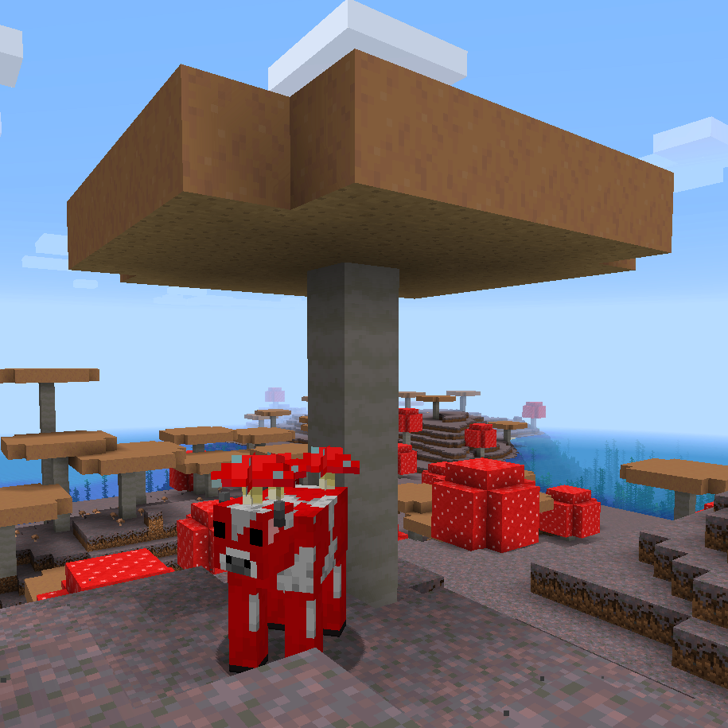
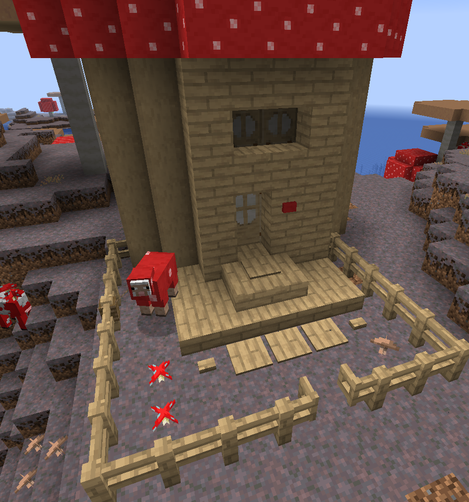

# Extended Mushrooms [.svg)](https://www.curseforge.com/minecraft/mc-mods/extended-mushrooms) [.svg)](https://www.curseforge.com/minecraft/mc-mods/extended-mushrooms/files)   

This is a **Minecraft Forge** mod and change some **mushroom behaviour** and adds mushroom related **blocks, items and recipes**.

## Installation

**Since 1.5.0**: Nothing more to do than install this mod.

**Before 1.5.0**: To use all features, it is recommended to install [MixinBootstrap](https://www.curseforge.com/minecraft/mc-mods/mixinbootstrap).

## Behaviour:

**Huge Mushrooms** can grow at random tick with a chance of 1:25 like trees. A difference to trees is, that Huge Mushrooms can only grow on specific blocks. On **Mycelium** and **Podzol** a mushroom can grow at any light level, but on **Dirt** and **Grass Block** it can only grow at light level below 13. 
These blocks are configurable with the tags _extendedmushrooms:mushroom_growing_blocks_ and _extendedmushrooms:mushroom_growing_blocks_lightlevel_.

The blocks of a **Huge Mushroom** have also a changed behaviour. **Mushroom Stem Block** drops itself and can be used as a new wood type. **Brown and Red Mushroom Blocks** drop a related mushroom with a chance of 0.3 (with Fortune up to 0.9). With **Shears** or a tool with **Silk Touch** enchantment you can get the block itself. It can be used as **Wool** to craft for example a red or brown bed.

## Blocks:

There are new blocks related to the new mushroom wood type:
* Mushroom Button
* Mushroom Door
* Mushroom Fence
* Mushroom Fence Gate
* Mushroom Pressure Plate
* Mushroom Slab
* Mushroom Stairs
* Mushroom Trapdoor
* Stripped Mushroom Stem

## Items:

### Mushroom Spores

**Mushroom Spores** can be used to turn **Dirt** into **Mycelium** and turn **Cows** into **Mooshrooms**. Two of them can be crafted with a mushroom of any type.

### Grilled Mushroom

**Grilled Mushroom** is a new food item which generates **2 hunger** and **0.3 saturation**. It can be cooked at campfire, furnace and smoker.

### Mushroom Bread

**Mushroom Bread** is a new food item which generates **5 hunger** and **0.3 saturation**. It can be crafted with 3 mushrooms of any type.

## Wiki

For more information check out the **Wiki**: https://github.com/cech12/ExtendedMushrooms/wiki